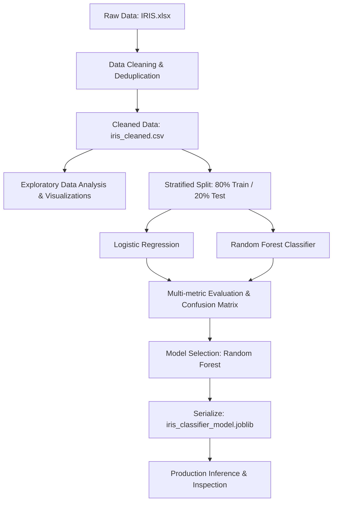

# 🌸 Iris Flower Classification Model

[](https://www.python.org/)
[](https://scikit-learn.org/)
[](https://pandas.pydata.org/)
[](LICENSE)

An end-to-end Machine Learning project to classify Iris flowers into three species (**Iris setosa**, **Iris versicolor**, and **Iris virginica**) based on sepal and petal measurements.

The project encompasses automated data cleaning, exploratory data analysis (EDA), multi-model benchmarking (Logistic Regression vs. Random Forest Classifier), feature importance decomposition, serialized model persistence, and real-time inference utilities.

---

## 📌 Table of Contents

- [Overview & Objectives](#-overview--objectives)
- [Dataset Summary](#-dataset-summary)
- [Project Architecture & Directory Structure](#-project-architecture--directory-structure)
- [Exploratory Data Analysis (EDA)](#-exploratory-data-analysis-eda)
- [Machine Learning Workflow](#-machine-learning-workflow)
- [Model Performance & Evaluation](#-model-performance--evaluation)
- [Feature Importance Analysis](#-feature-importance-analysis)
- [Installation & Setup](#-installation--setup)
- [Usage Guide](#-usage-guide)
  - [Run End-to-End Pipeline](#1-run-end-to-end-pipeline)
  - [Inspect Serialized Model](#2-inspect-serialized-model)
  - [Python Inference Snippet](#3-python-inference-snippet)
- [Author & Acknowledgments](#-author--acknowledgments)

---

## 🎯 Overview & Objectives

The primary objective is to reliably identify the species of an Iris flower given four morphological measurements:
1. **Sepal Length** (cm)
2. **Sepal Width** (cm)
3. **Petal Length** (cm)
4. **Petal Width** (cm)

### Key Milestones:
- **Data Quality**: Automated duplicate detection, missing value verification, and type sanitization.
- **Visual Analytics**: Generation of high-resolution correlation heatmaps, pairwise distributions, box plots, and feature relationship diagrams.
- **Model Training**: 80/20 stratified train-test split to ensure class balance across subsets.
- **Model Evaluation**: Comprehensive benchmarking across Accuracy, Precision, Recall, and F1-Score (Macro Average).
- **Deployment Readiness**: Packaging the production champion Random Forest model into a joblib binary (`iris_classifier_model.joblib`) accompanied by an inspection utility.

---

## 📊 Dataset Summary

The dataset is derived from the renowned Fisher's Iris dataset:
- **Original Source**: `IRIS.xlsx`
- **Cleaned Dataset**: `iris_cleaned.csv`
- **Total Samples**: 147 (after deduplicating redundant rows)
- **Features**: 4 continuous numerical dimensions
- **Target Variable**: `species` (3 balanced classes: *Iris-setosa*, *Iris-versicolor*, *Iris-virginica*)

---

## 📂 Project Architecture & Directory Structure

```plaintext
Iris_Flower_Classification/
├── IRIS.xlsx                      # Raw input dataset
├── iris_cleaned.csv               # Cleaned & processed dataset
├── main.py                        # Full training, EDA, and evaluation pipeline
├── inspect_model.py               # Model inspection & tree architecture debugger
├── iris_classifier_model.joblib   # Serialized champion model (Random Forest)
│
├── eda_correlation_matrix.png     # Feature correlation heatmap
├── eda_pairplot.png               # Pairwise parameter relationships & KDE densities
├── eda_boxplots.png               # Outlier analysis and species feature distributions
├── eda_scatter_relationships.png  # Petal vs Sepal dimension separation plots
├── model_evaluation_metrics.png   # Confusion matrices for evaluated models
└── README.md                      # Project documentation
```

---

## 🔍 Exploratory Data Analysis (EDA)

The pipeline automatically analyzes parameter distributions and bivariate relationships:

1. **Correlation Heatmap (`eda_correlation_matrix.png`)**:
   - High positive correlation between `petal_length` and `petal_width` ($r = 0.96$).
   - Strong correlation between petal dimensions and `sepal_length` ($r \approx 0.82$ to $0.87$).
   - Weak negative correlation between `sepal_length` and `sepal_width` ($r = -0.11$).

2. **Pairplot & Distributions (`eda_pairplot.png`)**:
   - **Iris-setosa** forms a distinctly separated cluster across all petal dimension plots, making it linearly separable.
   - **Iris-versicolor** and **Iris-virginica** exhibit slight boundary overlap in sepal dimensions but remain cleanly distinguishable when incorporating petal width and length.

3. **Boxplots & Outlier Identification (`eda_boxplots.png`)**:
   - Shows compact spreads with minimal outliers, confirming dataset stability.

---

## 🤖 Machine Learning Workflow



### Models Benchmarked:
1. **Logistic Regression**:
   - Hyperparameters: `solver='lbfgs'`, `max_iter=200`, `C=1.0`, `random_state=42`.
2. **Random Forest Classifier (Champion)**:
   - Hyperparameters: `n_estimators=100`, `criterion='gini'`, `random_state=42`.

---

## 📈 Model Performance & Evaluation

Both models were evaluated on the held-out 20% unseen test set (stratified):

| Model | Accuracy | Macro Precision | Macro Recall | Macro F1-Score | Status |
| :--- | :---: | :---: | :---: | :---: | :---: |
| **Random Forest Classifier** | **96.67%** | **96.97%** | **96.67%** | **96.66%** | 🏆 **Champion Model** |
| **Logistic Regression** | 93.33% | 94.44% | 93.33% | 93.27% | Baseline |

> Visual confusion matrices for both models are saved to [`model_evaluation_metrics.png`](model_evaluation_metrics.png).

---

## 💡 Feature Importance Analysis

Using the Random Forest ensemble, feature importances were extracted to understand the model's decision criteria:

| Feature | Importance Weight | Visual Representation |
| :--- | :---: | :--- |
| **`petal_length`** | **44.31%** | `██████████████████████` |
| **`petal_width`** | **41.47%** | `████████████████████` |
| **`sepal_length`** | **12.15%** | `██████` |
| **`sepal_width`** | **2.08%** | `█` |

> **Key Takeaway**: Petal dimensions account for **over 85%** of the model's predictive power. Sepal width provides marginal differentiation.

---

## ⚙️ Installation & Setup

### Prerequisites
- Python 3.8+ installed on your system.

### 1. Clone the Repository
```bash
git clone https://github.com/Dhritiman-Siva/Iris-Classification-Model.git
cd Iris-Classification-Model
```

### 2. Create and Activate a Virtual Environment
```bash
# Windows
python -m venv venv
venv\Scripts\activate

# macOS / Linux
python3 -m venv venv
source venv/bin/activate
```

### 3. Install Dependencies
```bash
pip install pandas openpyxl scikit-learn seaborn matplotlib joblib
```

---

## 🚀 Usage Guide

### 1. Run End-to-End Pipeline
Executes data preprocessing, visualizes EDA, trains models, evaluates metrics, and exports the serialized model:
```bash
python main.py
```

### 2. Inspect Serialized Model
Inspects `iris_classifier_model.joblib`, dumps tree rules, inspects internal metadata, and runs test inferences:
```bash
python inspect_model.py
```

### 3. Python Inference Snippet
Load and use the trained model directly in your applications:

```python
import joblib
import pandas as pd

# Load serialized model
model = joblib.load('iris_classifier_model.joblib')

# Define unseen flower measurements: [sepal_length, sepal_width, petal_length, petal_width]
sample = pd.DataFrame([[5.1, 3.5, 1.4, 0.2]], 
                      columns=['sepal_length', 'sepal_width', 'petal_length', 'petal_width'])

# Predict species and confidence
prediction = model.predict(sample)[0]
probabilities = model.predict_proba(sample)[0]
confidence = max(probabilities) * 100

print(f"Predicted Species: {prediction}")
print(f"Confidence: {confidence:.2f}%")
```

---

## 👤 Author & Acknowledgments

- **Repository**: [Dhritiman-Siva/Iris-Classification-Model](https://github.com/Dhritiman-Siva/Iris-Classification-Model)
- **Dataset**: Fisher's Classic Iris Dataset
